<!--CDN for bootstrap-icons-->
<link rel="stylesheet" href="https://cdn.jsdelivr.net/npm/bootstrap-icons@1.10.3/font/bootstrap-icons.css">

	

    

Desktop wallpaper by

[https://www.reddit.com/r/FrutigerAero/comments/12lu6wv/frutiger_aero_11/](https://www.reddit.com/r/FrutigerAero/comments/12lu6wv/frutiger_aero_11/)

	

	
<h2><b>👨‍🏫 My Bio</b></h2>

	
👋 Hi there, here just an Indonesian (🇮🇩) who feel delightful in <i>science of computation</i> 💻📚.
	I use this GitHub as a place of repository of my works ✒️ such as
	code, R package, notebook, and manuscript. 
	<b>Heuristic Method, Numerical Analysis, Probability Theory & Stochastics Proccess, and Statistics</b> are my favorite subjects. 
	My current interest is <b>Numerical Algorithms</b>. 

	
<h2><b>📊 My Statistics</b></h2>

	

		
		
	

	
<h2><b>🚀 My Skill Set</b></h2>

	<i class="bi bi-code-slash"></i> Web development

<table align="center">
  <tr>
      <td align="center" width="96">
        
       HTML
    </td>
    <td align="center" width="96">
      
       CSS
    </td>
    <td align="center" width="96">
    		
    		 Javascript
    </td>
    <td align="center" width="96">
    		
    		 Bootstrap
    </td>
	<td align="center" width="96">
    		
    		 MySQL
    </td>
    <td align="center" width="96">
    		
    		 GitHub
    </td>
	<td align="center" width="96">
    		
    		 Bash
    </td>
    	<td align="center" width="96">
    		
    		 Git
    </td>
        	<td align="center" width="96">
    		
    		 Markdown
    </td>
  </tr>
  <tr>
</table>
  

<i class="bi bi-terminal"></i> Computation

<table align="center">
  <tr>
      <td align="center" width="96">
        
       C++
    </td>
    <td align="center" width="96">
      
       Python
    </td>
    <td align="center" width="96">
    		
    		 R
    </td>
    <td align="center" width="96">
    		
    		 Julia
    </td>
	<td align="center" width="96">
    		
    		 Java
    </td>
    <td align="center" width="96">
    		
    		 Octave
    </td>
	<td align="center" width="96">
    		
    		 Lua
    </td>
  </tr>
  <tr>
</table>
  

<i class="bi bi-laptop"></i> Operating Systems (I've Ever Use)

  

Currently, I use **EndeavourOS** Linux and **MS Windows 11**  as my daily operating system.

<i class="bi bi-code-square"></i> Code Editors and IDE

<table align="center">
  <tr>
      <td align="center" width="96">
        
       NvChad
    </td>
    <td align="center" width="96">
        
       Neovim
    </td>
    <td align="center" width="96">
        
       VIM
    </td>
    <td align="center" width="96">
        
       VSCode
    </td>
    <td align="center" width="96">
        
       Visual Studio
    </td>
    <td align="center" width="96">
    		
    		 Positron
    </td>
    <td align="center" width="96">
    		
    		 RStudio
    </td>
    <td align="center" width="96">
    		
    		 ghostwriter
    </td>
    <td align="center" width="96">
    		
    		 LyX
    </td>
  </tr>
  <tr>
</table>
  

Etc

